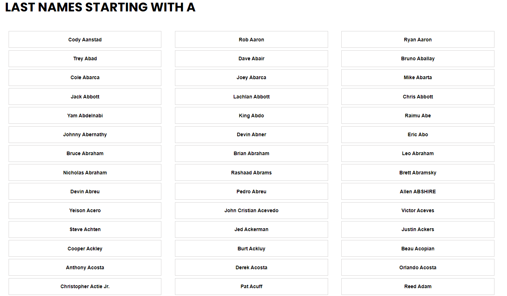
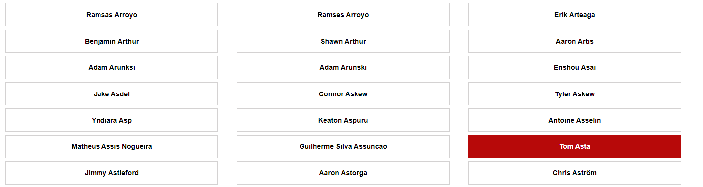
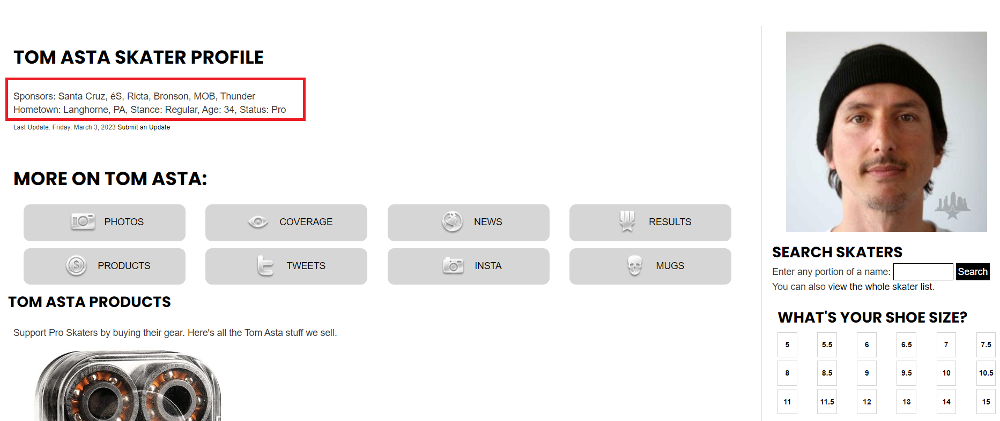
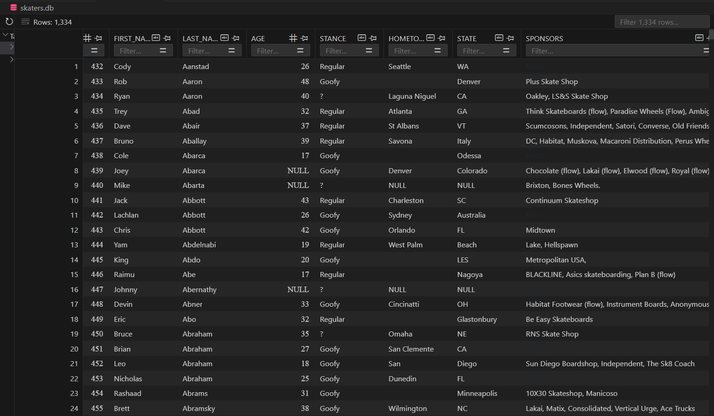
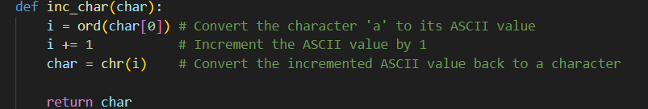

## Skateboarder Database

### I crafted a Python script to scrape a website's public online database to extract and store about thousands of skateboarders registered in their system.

#### 1. Traverses online database from A-Z

#### 2. Button click to get skater attribute data

#### 3. Extract date and store in database

#### 4. Database

#### 5. URL deconstruction to automate database traversal by page

